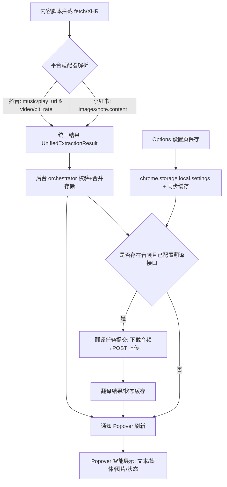

## 目标与范围
- 将 Popover 与设置页统一呈现为“[平台名称] 下载器 / 设置”的结构与文案。
- 动态显示平台名称（抖音/小红书等），智能展示最相关的菜单项。
- 为拦截、解析、编排、存储、下载、翻译、UI 交互的每一步补充可控的 Debug 日志。
- 提供开发流程图，描述数据从拦截到 UI 的完整链路。

## UI 结构调整（不改功能，仅统一样式与文案）
- Popover（src/popup）
  - 标题：`[平台名称] 下载器`（平台名由当前上下文 `context.platform` 推断并映射中文）
  - 主菜单（严格按你给的结构与顺序）：
    - `[📄] 下载文本 ▶`（存在文本才显示）
    - `[📥] 下载媒体 ▶`（视频或音频存在才显示，图标根据类型动态切换）
    - `[🖼] 下载此图片 ▶`（存在图片才显示）
  - 分隔线与次级菜单固定：
    - `[⚙️] 设置`、`[❗️] 报告错误`、`[💛] 欢迎捐赠`、`[⚠️] 正在加载菜单...`、`v0.3.6`
  - 智能化：仅展示当前平台相关类型；音频存在且已配置翻译接口时，显示“翻译中/已完成/失败”状态徽标。
- 设置页（src/options）
  - 标题：`[平台名称] 下载器设置`（同上动态平台名称）
  - 字段与文案完全按你提供的结构；说明文案保持一致。
  - 保存到 `chrome.storage.local.settings`，并更新同步缓存供后台快速读取翻译配置。

## 平台名称映射
- 在 `src/popup/main.ts` 与 `src/options/main.ts` 添加中文名称映射：
  - `douyin → 抖音`，`xiaohongshu → 小红书`
  - 当无法识别则显示通用“下载器”。

## Debug 日志方案（全链路）
- 统一日志函数：`src/core/logger.ts`
  - 提供 `logDebug(scope, msg, data?)`、`logInfo(scope, msg)`、`logError(scope, err)`；scope 建议格式 `adapter:douyin`、`hook:fetch`、`core:orchestrator`、`ui:popup` 等。
  - 每条日志包含：`timestamp`、`contextId`（若有）、`platform`（若有）、事件名与关键字段。
- 日志注入点：
  - 拦截层：`hookFetch/hookXhr` 命中规则时记录请求 URL、响应长度、解析路径。
  - 适配器：抖音/小红书解析成功后记录项数、各项 kind 与溯源 `path`。
  - 编排层：接收统一结果、校验通过/失败、合并去重数量、广播刷新。
  - 存储层：写入/读取键名（`extraction:*`、`translation:*`）、变更摘要。
  - 下载层：下载触发、生成的 `filename`、判断重复逻辑（若开启去重）。
  - 翻译层：任务创建/去重、上传大小、接口 URL、返回状态与文本长度、失败重试次数。
  - UI 层（Popover/Options）：渲染项数量、点击操作、设置保存与清理动作。
- 日志级别默认在开发模式启用（通过 `settings.debug=true` 或环境变量），生产可降级到 `info/error`。

## 流程图

## 数据 Case（抖音，对齐你的规则）
- URL：`https://www.douyin.com/video/7575974733368266036` → 纯数字 ID `7575974733368266036`
- 音频提取：`music.play_url.url_list[0]`
- 视频提取：`video.bit_rate[*].play_addr.url_list[0]`
- 若页面 URL 无 ID：使用 `data-e2e="feed-active-video"` 的 `data-e2e-vid` 作为当前视频 ID。
- 相关性选择：与页面 ID 相同的媒体优先；URL 变化则重新提取与排序。

## 实施步骤（不改动架构，仅增强 UI 与日志）
1. Popover/Options 中引入平台名称映射与版式文案，严格按你给出的结构渲染。
2. 在 `logger.ts` 扩展 `logDebug` API，并在各模块关键路径插入日志（保持最少侵入）。
3. 在编排与翻译模块补充上下文 ID 与平台的日志标签，方便定位同一条链路。
4. 验证：真实页面抽样测试抖音/小红书的菜单显示与翻译流程；控制台观察 debug 日志完整性。

## 交付内容
- UI：符合你提供结构的 Popover 与设置页，动态平台标题与菜单。
- 日志：可在控制台查看完整链路的 debug 信息（可开关）。
- 文档：更新项目 README/设计文档，附流程图与日志说明。
