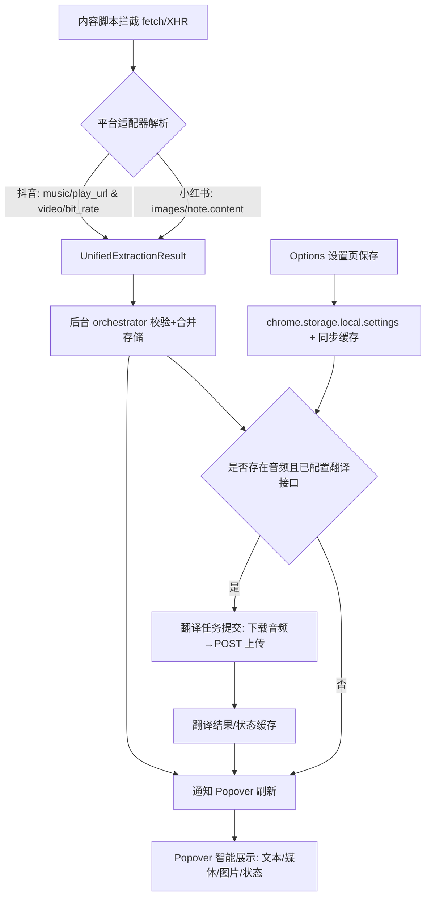

# 流程图与日志规范（TypeScript，Chrome MV3）

## 流程图（Mermaid）

## 日志规范
- 函数：`logDebug(scope, msg, data?)`、`logInfo(scope, msg)`、`logError(scope, err)`
- Scope 建议：
  - 拦截：`hook:fetch`、`hook:xhr`
  - 适配器：`adapter:douyin`、`adapter:xhs`
  - 核心：`core:orchestrator`、`core:storage`、`core:downloads`、`translate`
  - UI：`ui:popup`、`ui:options`
- 字段：包含 `timestamp`（由控制台生成）、`contextId`、`platform`、事件与关键数据（如 items 数量、键名、文件名、文本长度）。
- 开关：开发默认开启，生产可降级到 `info/error`。

## 抖音数据 Case（对齐规则）
- URL：`https://www.douyin.com/video/7575974733368266036` → 纯数字 ID `7575974733368266036`
- 音频：`music.play_url.url_list[0]`
- 视频：`video.bit_rate[*].play_addr.url_list[0]`
- 兜底：DOM `data-e2e="feed-active-video"` 的 `data-e2e-vid`

