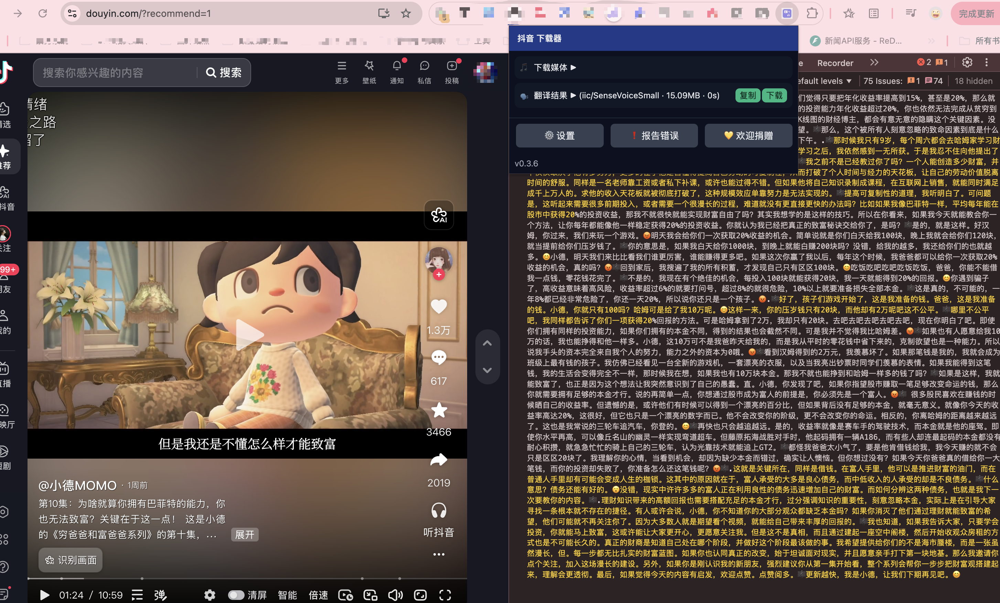
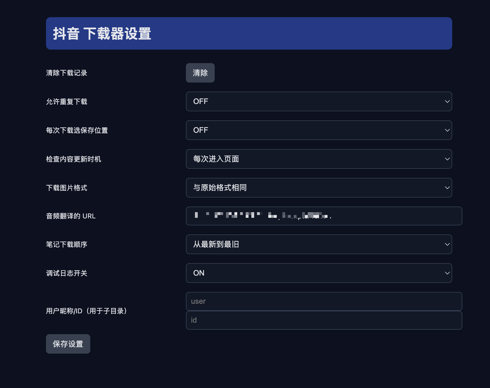
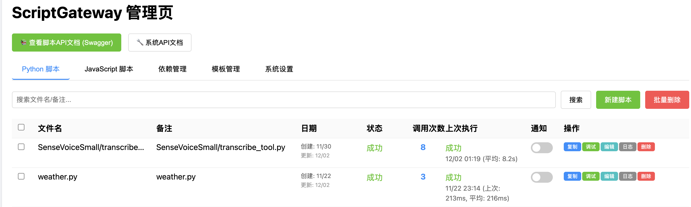

# 社交媒体音频提取与翻译工具 / Social Media Audio Extraction and Translation Tool

<div align="center">
  
</div>

## 项目概述 / Project Overview

**项目名称 / Project Name**: 社交媒体音频提取与翻译工具 / Social Media Audio Extraction and Translation Tool

**主要功能 / Main Features**: 
- 从抖音、小红书等平台提取音频和视频内容 / Extract audio and video content from platforms like Douyin, Xiaohongshu
- 支持音频翻译功能 / Support audio translation functionality

**适用场景 / Use Cases**:
- 财经内容分析 / Financial content analysis
- 视频搬运与二次创作 / Video content repurposing and secondary creation
- 多语言内容学习 / Multilingual content learning

**开源协议 / Open Source License**: MIT License

---

## 功能说明 / Features

### 音频提取功能 / Audio Extraction Feature
- **支持平台 / Supported Platforms**:
  - ✅ 抖音 / Douyin (已实现 / Implemented)
  - 🚧 小红书 / Xiaohongshu (待开发 / Under Development)
  
- **输出格式 / Output Formats**: 
  - MP3/WAV (音频 / Audio)
  - MP4 (视频 / Video)

### 音频翻译功能 / Audio Translation Feature
- **依赖第三方接口 / Third-party API Dependency**: script-gateway (需自行部署 / Requires self-deployment)
- **常用模型 / Common Models**:
  - SenseVoiceSmall
  - whisper_base
- **接口地址配置说明 / API Configuration**: 在设置页面配置翻译API地址 / Configure translation API address in settings page

---

## 安装与配置 / Installation & Configuration

### 环境要求 / Requirements
- Chrome 浏览器 (版本 88+) / Chrome Browser (Version 88+)
- Node.js (版本 16+) / Node.js (Version 16+) - 仅用于开发 / Development only

### 依赖安装步骤 / Installation Steps

#### 用户安装 / User Installation
1. 下载最新版本的扩展包 / Download the latest extension package
2. 解压到本地文件夹 / Extract to a local folder
3. 打开Chrome浏览器，进入 `chrome://extensions/` / Open Chrome browser and navigate to `chrome://extensions/`
4. 开启"开发者模式" / Enable "Developer mode"
5. 点击"加载已解压的扩展程序" / Click "Load unpacked"
6. 选择解压的文件夹 / Select the extracted folder

#### 开发环境搭建 / Development Setup
```bash
# 克隆仓库 / Clone repository
git clone https://github.com/your-username/chrome-ext-audio-transform.git
cd chrome-ext-audio-transform

# 安装依赖 / Install dependencies
npm install

# 开发模式 / Development mode
npm run dev

# 构建生产版本 / Build for production
npm run build
```

### 配置文件说明 / Configuration File说明

主要配置项 / Main Configuration Items:
- **翻译API地址 / Translation API Address**: `http://your-server:port/api/scripts/{model-id}/run`
- **用户昵称/ID / User Nickname/ID**: 用于创建下载子目录 / Used for creating download subdirectories
- **调试模式 / Debug Mode**: 开启后可在控制台查看详细日志 / Enable to view detailed logs in console

### 第三方翻译服务部署指南 / Third-party Translation Service Deployment Guide

#### 使用 script-gateway 部署 / Deploy with script-gateway
1. 获取 script-gateway 源码 / Get script-gateway source code
2. 部署到您的服务器 / Deploy to your server
3. 配置 SenseVoiceSmall 或 whisper_base 模型 / Configure SenseVoiceSmall or whisper_base model
4. 在扩展设置中配置API地址 / Configure API address in extension settings

---

## 使用教程 / Usage Guide

### 基础使用流程 / Basic Usage Flow

1. **安装扩展 / Install Extension**
   - 按照上述安装步骤安装扩展 / Follow the installation steps above

2. **访问支持的平台 / Visit Supported Platforms**
   - 打开抖音网页版 / Open Douyin web version
   - 浏览到包含音频的视频内容 / Navigate to video content containing audio

3. **提取音频 / Extract Audio**
   - 点击浏览器工具栏中的扩展图标 / Click the extension icon in the browser toolbar
   - 在弹出的界面中查看可提取的音频内容 / View extractable audio content in the popup
   - 点击下载按钮保存音频文件 / Click the download button to save the audio file

4. **配置翻译 / Configure Translation**
   - 点击"设置"按钮 / Click the "Settings" button
   - 配置翻译API地址 / Configure translation API address
   - 选择翻译模型 / Select translation model
   - 保存设置 / Save settings

5. **翻译音频 / Translate Audio**
   - 在音频列表中点击"翻译"按钮 / Click the "Translate" button in the audio list
   - 等待翻译完成 / Wait for translation to complete
   - 下载翻译后的文件 / Download the translated file

### 参数配置详解 / Parameter Configuration Details

<div align="center">
  
</div>

| 参数 / Parameter | 说明 / Description | 默认值 / Default |
|-----------------|-------------------|------------------|
| 翻译API / Translation API | 第三方翻译服务地址 / Third-party translation service address | 空 / Empty |
| 用户昵称 / User Nickname | 用于创建下载子目录 / Used for creating download subdirectories | user |
| 用户ID / User ID | 用于创建下载子目录 / Used for creating download subdirectories | id |
| 重复下载 / Repeat Download | 是否允许重复下载相同内容 / Whether to allow downloading the same content repeatedly | OFF |
| 自动选择位置 / Auto Choose Location | 自动选择下载位置 / Automatically choose download location | OFF |
| 刷新策略 / Refresh Strategy | 内容刷新时机 / Content refresh timing | 从不 / Never |
| 图片格式 / Image Format | 下载图片的格式 / Download image format | 与原始格式相同 / Same as original |
| 翻译顺序 / Translation Order | 翻译任务处理顺序 / Translation task processing order | 从最新到最旧 / Newest to oldest |
| 调试模式 / Debug Mode | 是否开启调试日志 / Whether to enable debug logs | ON |

### 常见问题解决方案 / Common Issues & Solutions

**Q: 扩展无法提取音频？**
- A: 确保您在支持的平台页面上，并且页面已完全加载 / Ensure you are on a supported platform page and the page has fully loaded

**Q: 翻译功能无法使用？**
- A: 检查API地址配置是否正确，确保翻译服务正常运行 / Check if the API address is configured correctly and the translation service is running normally

**Q: 下载的文件为空或损坏？**
- A: 尝试刷新页面后重新提取，或检查网络连接 / Try refreshing the page and extracting again, or check your network connection

---

## 多语言支持 / Multilingual Support

- **默认语言 / Default Language**: 中文 / Chinese
- **英文翻译版本 / English Version**: 本文档提供中英文双语版本 / This document provides bilingual Chinese and English versions

---

## 附录 / Appendix

### 截图说明 / Screenshots

<div align="center">
  <h3>操作界面截图 / Interface Screenshots</h3>
  
  <p>主界面 / Main Interface</p>
  
  
  <p>设置界面 / Settings Interface</p>
  
  
  <p>第三方语音服务配置 / Third-party Voice Service Configuration</p>
</div>

### 版本更新记录 / Version History

#### v0.3.6 (当前版本 / Current Version)
- ✅ 实现抖音音频提取功能 / Implemented Douyin audio extraction
- ✅ 添加翻译功能支持 / Added translation support
- ✅ 优化用户界面 / Optimized user interface
- 🚧 小红书支持开发中 / Xiaohongshu support under development

### 贡献指南 / Contributing Guide

欢迎贡献代码！请遵循以下步骤 / Contributions are welcome! Please follow these steps:

1. Fork 本仓库 / Fork this repository
2. 创建功能分支 / Create a feature branch (`git checkout -b feature/AmazingFeature`)
3. 提交更改 / Commit your changes (`git commit -m 'Add some AmazingFeature'`)
4. 推送到分支 / Push to the branch (`git push origin feature/AmazingFeature`)
5. 创建 Pull Request / Create a Pull Request

### 许可证 / License

本项目采用 MIT 许可证 - 查看 [LICENSE](LICENSE) 文件了解详情 / This project is licensed under the MIT License - see the [LICENSE](LICENSE) file for details

### 联系方式 / Contact

如有问题或建议，请通过以下方式联系 / For questions or suggestions, please contact:

- 创建 Issue / Create an Issue
- 邮箱 / Email: [your-email@example.com]

---

<div align="center">
  <p>如果这个项目对您有帮助，请考虑给我们一个 ⭐️ / If this project helps you, please consider giving us a ⭐️</p>
</div>